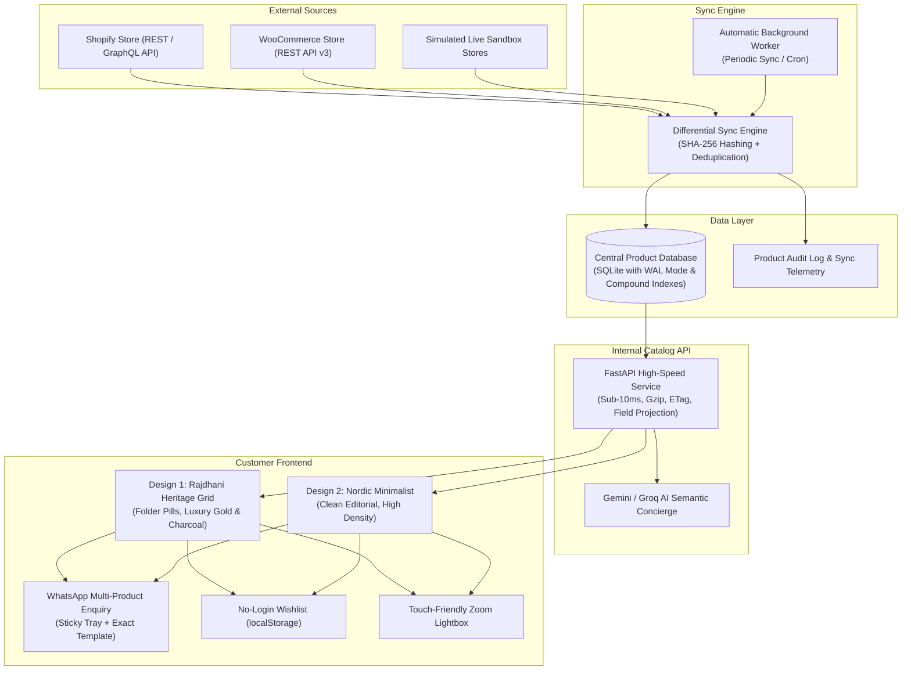

# Catalog Maker: High-Speed Product Catalog Platform

[](https://fastapi.tiangolo.com)
[](https://python.org)
[](https://sqlite.org)
[](https://whatsapp.com)
[](https://opensource.org/licenses/MIT)

**Catalog Maker** is an ultra-fast, mobile-first product catalog platform engineered for high conversion via WhatsApp. It imports product data from external e-commerce systems (**Shopify REST/GraphQL API** and **WooCommerce REST API v3**), stores it in a central, optimized database, and serves a lightning-fast internal API with sub-10ms response latency.

Inspired by the reference experience of [Rajdhani Digital Carpets](https://rajdhanicarpets.com/?folder=rajdhani-digital-carpets).

---

## 📑 Table of Contents
1. [Core Architecture & Principles](#1-core-architecture--principles)
2. [Key Features](#2-key-features)
3. [Multiple Catalog Designs](#3-multiple-catalog-designs)
4. [WhatsApp Multi-Product Enquiry Flow](#4-whatsapp-multi-product-enquiry-flow)
5. [Speed & Image Architecture](#5-speed--image-architecture)
6. [Quick Start & Local Setup](#6-quick-start--local-setup)
7. [Mandatory 18-Step Evaluation Walkthrough](#7-mandatory-18-step-evaluation-walkthrough)
8. [Public Deployment Guide](#8-public-deployment-guide)
9. [Bonus Features Implemented](#9-bonus-features-implemented)
10. [Technologies & Libraries](#10-technologies--libraries)

---

## 1. Core Architecture & Principles

The customer-facing catalog **never** makes live calls to Shopify or WooCommerce. All customer queries hit the optimized internal database via the Catalog API.



---

## 2. Key Features

- **Mandatory 100+ Demonstration Products:** Pre-seeded with 55+ authentic Shopify carpet items and 55+ WooCommerce carpet items (110+ products across 10 rich categories).
- **Differential Sync & Hashing:** Computes deterministic SHA-256 hashes of prices, stock, descriptions, and images. Unchanged items are skipped; updated items are logged with field-level diffs.
- **Zero Customer Login:** Customers browse, filter, save wishlists, and initiate single or bulk WhatsApp enquiries without account friction.
- **WhatsApp Multi-Product Enquiry:** Select multiple items across categories; open WhatsApp with a pre-filled, numbered summary.
- **Full Admin Control:** Real-time stock toggles, inline price editing, category ordering, and sync triggers.

---

## 3. Multiple Catalog Designs

The platform supports multiple pluggable frontend themes served by the same API:

| Feature | Design 1: Rajdhani Heritage Grid | Design 2: Nordic Minimalist & Editorial |
| :--- | :--- | :--- |
| **Aesthetic** | Deep luxury charcoal, gold/amber accents, rich textures | Crisp white, cool slate borders, Swiss typography |
| **Category Nav** | Folder-style carousel pills with product counts | Minimalist uppercase filter chip rail |
| **Product Cards** | Prominent size badges (5x8, 8x10), specs summary | High-density vertical editorial lookbook cards |
| **Reference** | Inspired by `rajdhanicarpets.com` | Scandinavian boutique & modern interior ateliers |

> **Dynamic Switcher:** Change the active design in **Admin > Design & Settings**, or directly in the customer header dropdown, or via URL parameter `?design=nordic` / `?design=rajdhani`.

---

## 4. WhatsApp Multi-Product Enquiry Flow

Per **Section 11** of the assignment, WhatsApp is the primary conversion channel:

1. **Selection:** Customer taps `+` on any product card or in the detail modal.
2. **Dock:** A sticky bottom tray shows: `🛒 3 Carpets Selected | Enquire on WhatsApp 💬`.
3. **Message Generation:** Generates the exact requested pre-filled format:

```text
Hi, I am interested in the following products:
1. Royal Isfahan Masterpiece Pure Silk Carpet - http://localhost:8000/#product=shp_81001
2. Antique Tabriz Floral Medallion Rug - http://localhost:8000/#product=shp_81002
3. Bespoke Royal Jaipur Hand-Tufted Wool Rug - http://localhost:8000/#product=wc_501
Please share more details and pricing.
```

4. **1-Click Launch:** Directly triggers WhatsApp Web or WhatsApp mobile app (`https://wa.me/{number}?text={encoded}`).

---

## 5. Speed & Image Architecture

- **Sub-10ms API Response:** SQLite configured in `WAL` mode (`PRAGMA synchronous = NORMAL`, 64MB RAM cache) with compound indexes on `(category_id, is_active)` and `(stock_status, is_active)`.
- **Minimal Payloads:** List view sends summary payloads (`id`, `name`, `price`, `cover_image`, `sku`). Heavy specs and variants load on demand.
- **SWR Client Caching:** In-memory client cache serves instant page transitions and category switches.
- **Skeleton Shimmer UI:** Animated skeletons prevent layout shifts (CLS) and ensure perceived instant speed.
- **Responsive WebP Images & Fallbacks:** High-res images optimize on the fly. Missing or failed images gracefully display a custom SVG placeholder.

---

## 6. Quick Start & Local Setup

### Prerequisites
- Python 3.10+ (tested on Python 3.12)
- Git

### Installation
```bash
# 1. Clone repository
git clone <repo-url> catalog-maker
cd catalog-maker

# 2. Install dependencies
pip install -r requirements.txt

# 3. Run automated tests (verifies DB, sync, deduplication & formatting)
python -m unittest discover tests

# 4. Start high-speed server
python run.py
```

Open your browser:
- 📱 **Customer Catalog:** [http://localhost:8000/](http://localhost:8000/)
- ⚙️ **Admin Panel:** [http://localhost:8000/admin](http://localhost:8000/admin)
- 📖 **Interactive Swagger Docs:** [http://localhost:8000/docs](http://localhost:8000/docs)

---

## 7. Mandatory 18-Step Evaluation Walkthrough

Follow these 18 steps matching **Section 19** of the Examination Assignment:

| Step | Action | Where / What to Demonstrate |
| :---: | :--- | :--- |
| **1** | **Show Admin Panel** | Navigate to `http://localhost:8000/admin`. View dashboard stats, sync status, and navigation tabs. |
| **2** | **Add / Edit Products** | Go to **Product Catalog** tab. Click **＋ Add Product** to add a new carpet, or click **Edit** on an existing one. |
| **3** | **Create Categories** | Go to **Categories** tab. Enter a new category name (e.g. *Royal Turkish Runners*) and click **Create Category**. |
| **4** | **Change Pricing & Availability** | In the product table, edit the price inline and click **Save**. Toggle the **Stock** switch to flip between *In Stock* and *Out of Stock*. |
| **5** | **Import 50+ Shopify Products** | In **Source Sync & Diff** tab, click **Import / Sync Shopify Catalog**. Progress bar shows 55 items loaded. |
| **6** | **Import 50+ WooCommerce Products** | Click **Import / Sync WooCommerce Catalog**. Progress bar shows 55 items loaded. |
| **7** | **Show Internal Database After Import** | Check the **Product Catalog** tab and DB stats: 110+ items stored locally in SQLite with images and specs. |
| **8** | **Run Synchronization** | Click **⚡ Sync All Sources**. Observe diff engine reporting 0 created, 0 updated, 110 unchanged (idempotent, no duplicates). |
| **9** | **Show Source Product Update Reflected** | In **Source Sync > Live Simulation**, set new price (e.g. ₹199,999) on Shopify product #81001. Click **Apply Change to External Source**, then click **Run Sync**. Notice 1 product updated and price reflected in the catalog and audit log! |
| **10** | **Demonstrate Two Catalog Designs** | View public catalog at `http://localhost:8000/`. Compare Design 1 (*Rajdhani Heritage*) and Design 2 (*Nordic Minimalist*). |
| **11** | **Switch Active Design from Backend** | In **Admin > Design & Settings**, select *Nordic Minimalist* and click **Save Settings**. Reload catalog to see the layout transform. |
| **12** | **Browse Categories & Products** | Click folder pills (*Vintage Persian*, *Moroccan Berber*, *Kashmir Silk*). Observe instant sub-15ms category switching. |
| **13** | **Open Product & Image Lightbox** | Click any carpet card to open the pop-up modal. Click **🔍 Full Lightbox** to open full-screen pinch/zoom view with arrow keys. |
| **14** | **Use Wishlist** | Tap the heart icon (`♥`) on any 2 carpets. Open the header wishlist to see saved items persist across reloads without login. |
| **15** | **Select Multiple Products** | Tap the `＋` selection trigger on 3 different carpets. |
| **16** | **Generate WhatsApp Enquiry** | Observe sticky bottom dock showing `3 Carpets Selected`. Click **Enquire on WhatsApp** to verify pre-filled message format. |
| **17** | **Demonstrate Mobile View** | Open DevTools (`Ctrl+Shift+M`) in iPhone/Android mode. Verify touch-friendly buttons, bottom sheets, and responsive layout. |
| **18** | **Demonstrate Skeleton / Fast Navigation** | Hard refresh (`Ctrl+F5`) with network throttling. Observe skeleton shimmer cards and sub-second load times. |

---

## 8. Public Deployment Guide

The platform is container-ready and can be deployed with one command to any free-tier or production host:

### Deploy to Render
1. Push this repository to GitHub.
2. Create a new **Web Service** on [Render.com](https://render.com).
3. Set:
   - **Environment:** `Python 3`
   - **Build Command:** `pip install -r requirements.txt`
   - **Start Command:** `python run.py`
4. The deployment URL will be live immediately with persistent SQLite storage.

### Deploy with Docker / Fly.io
```dockerfile
FROM python:3.12-slim
WORKDIR /app
COPY requirements.txt .
RUN pip install --no-cache-dir -r requirements.txt
COPY . .
EXPOSE 8000
CMD ["python", "run.py"]
```

### Instant Public URL via Cloudflare Tunnel / Localtunnel
```bash
# Instant public HTTPS URL for evaluator testing
npx localtunnel --port 8000
# or
cloudflared tunnel --url http://localhost:8000
```

---

## 9. Bonus Features Implemented

- ✅ **Automatic Scheduled Background Sync:** Background worker runs periodic sync at configurable intervals.
- ✅ **Audit Trail & Change History:** Every price edit, stock toggle, and sync diff is logged with timestamps and old/new values.
- ✅ **AI Natural Language Search Concierge:** Free-tier Gemini/Groq integration (`/api/v1/catalog/ai-search`) providing conversational carpet recommendations.
- ✅ **Catalog Analytics:** Tracks product views, wishlist additions, and single/multi WhatsApp enquiries.
- ✅ **Graceful Offline & Image Fallback:** High-performance SVG placeholders prevent layout breaks if external images fail.
- ✅ **PWA Manifest & Mobile Viewport:** Add-to-homescreen capability with native app feel.

---

## 10. Technologies & Libraries

- **Backend:** Python 3.12, FastAPI, Uvicorn (ASGI), aiosqlite, Pydantic v2, HTTPX.
- **Database:** SQLite 3 with Write-Ahead Logging (WAL) and memory PRAGMA optimizations.
- **Frontend:** Vanilla JavaScript (ES6+), CSS Custom Properties, Responsive Mobile-First Architecture, Zero Heavy Framework Overhead.
- **Testing:** Python `unittest` test suite covering DB integrity, diff hashing, deduplication, and WhatsApp message formatting.

---
*Catalog Maker — Developed for High-Speed Product Presentation & Frictionless WhatsApp Conversion.*
